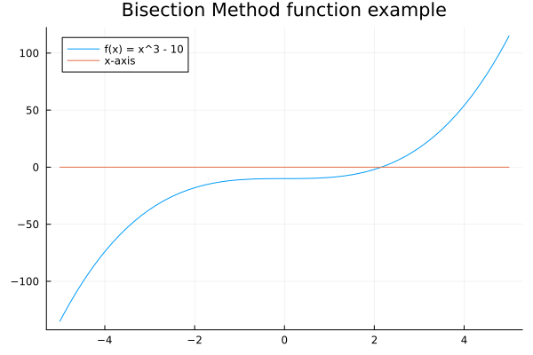

# Bisection method
If $f$ is a continuous function on the interval $[a, b]$ and $f(a)$ and $f(b)$ have opposite signs, then there is at least one root in the interval $(a, b)$. The bisection method is a simple numerical technique to find the root of an equation.

## Algorithm
The bisection method exploits this idea in the following way. If $f(a)f(b)<0$ then we compute $c=\frac{1}{2}(a+b)$ and test whether $f(c)=0$. If $f(c)=0$ then $c$ is the root of the equation. If $f(a)f(c)<0$ then the root lies in the interval $(a,c)$ so we set $b=c$. If $f(b)f(c)<0$ then the root lies in the interval $(c,b)$ so we set $a=c$. We repeat this process until the interval is sufficiently small.


## Code
The following Julia code implements the bisection method.
```julia
function bisection(f,a,b,max_iter,err,tol)
    if sign(f(a)) == sign(f(b))
        error("f(a) and f(b) must have opposite signs")
    end
    u = f(a)
    v = f(b)
    e = b-a
    for k = 1:max_iter
        e = e/2
        c = a + e
        w = f(c)
        if abs(e) < tol || abs(w) < err
            return c
        end
        if sign(w) != sign(u)
            b = c
            v = w
        else
            a = c
            u = w
        end
    end
    return c
end
```

## Example
Let's find the root of the equation $f(x)=x^3-10$ in the interval $[-5,5]$.

```julia
c = bisection(x -> x^3 - 5, -5, 10, 100, 1e-6, 1e-6)
print("The root is: ", c, "\n")
```
We can execute following the next prototype.
```bash
$ julia "bisection\bisection_method1.jl"
```
And the output is `The root is: 2.154434025287628`.